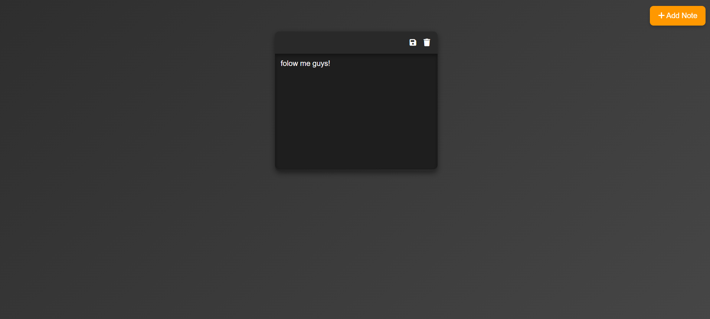

# Quick Notes

**Quick Notes** is a simple yet visually appealing note-taking app with smooth animations and a modern dark theme. Users can add, edit, and remove notes with ease. The app is fully responsive, ensuring an optimal experience on both desktop and mobile devices.

## Features
- **Add New Notes**: Create a new note by clicking the "Add" button at the top-right corner of the page.
- **Edit Notes**: Easily edit the content of each note using a sleek toolbar with intuitive icons.
- **Delete Notes**: Remove notes when you're done with them.
- **Responsive Design**: Optimized for all screen sizes, providing a seamless experience across devices, from desktops to smartphones.
- **Modern Design**: Featuring a dark theme with smooth transitions, shadow effects, and a minimalist aesthetic for a sleek user experience.

## Preview Interface

Here’s a preview of the app’s interface:

## How to Use
1. **Adding a New Note**: Click the "Add" button at the top-right corner of the screen to create a new note. The text area will appear where you can write your content.
2. **Editing Notes**: Each note comes with a toolbar (visible when hovering over the note) that allows you to edit the content. You can easily update the note's text.
3. **Deleting Notes**: Use the trash icon on the toolbar to delete a note. It's a quick way to remove any note you no longer need.

## Mobile Optimization
- **Optimized for Mobile**: The app features a fully responsive layout, ensuring it adapts smoothly to any screen size, whether you're on a smartphone, tablet, or desktop.
- **Mobile-Specific Features**: The "Add" button and text areas adjust seamlessly for mobile screens, maintaining usability and clarity across all devices.

## Technologies Used
- **HTML5**: Structure and content of the app.
- **CSS3**: Styling and layout, including responsive design, animations, and transitions.
- **JavaScript**: Adds interactivity for adding, editing, and deleting notes.
- **Font Awesome**: Used for the icons in the toolbar (Add, Edit, Delete).
- **Flexbox**: Employed for the responsive layout, ensuring proper alignment of elements on various screen sizes.
- **Media Queries**: For mobile optimization, ensuring an excellent experience on smaller devices.

## Acknowledgments
- **Design Inspiration**: The layout and user interface were inspired by modern UI frameworks and design patterns for a sleek, minimalist aesthetic.
- **Font Awesome**: Icon library used for enhancing the UI with visually appealing icons like Add, Edit, and Delete.
- **Flexbox & Media Queries**: Employed to create a fluid, responsive layout that adjusts across devices.

## Roadmap
- **Future Updates**: 
    - Implement note categorization.
    - Sync notes with cloud storage for backup.
    - Add text formatting options (bold, italics, etc.).
    - Integrate a dark/light mode toggle for user preference.

---
Follow me, or I’ll create a reminder note just for you! 😄